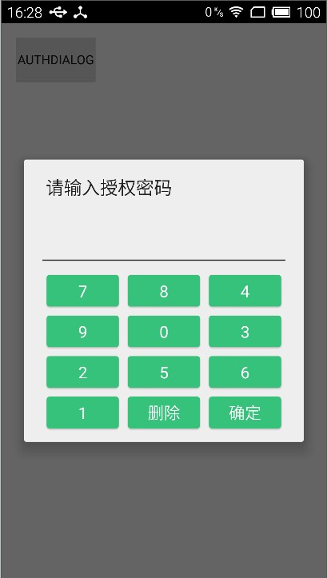

[](https://bintray.com/msdx/maven/InputPassword/_latestVersion)

InputPassword
===

InputPassword是一个简单的数字密码验证对话框。界面如下：



#使用方式

## 声明仓库
```gradle
    repositories {
        jcenter()
    }
```
## 声明依赖
```gradle
    compile 'com.githang:inputpassword:0.3'
    compile 'com.android.support:gridlayout-v7:24.1.0'
```

## Java代码调用
```java
        final AuthDialog dialog = new AuthDialog(this);
        dialog.setOnEnterListener(new AuthDialog.OnEnterListener() {
            @Override
            public void onInput(AuthDialog dialog, String input) {
                if(input.equals("135795")) {
                    dialog.dismiss();
                } else {
                    dialog.showError("密码是135795");
                }
            }
        });
```
